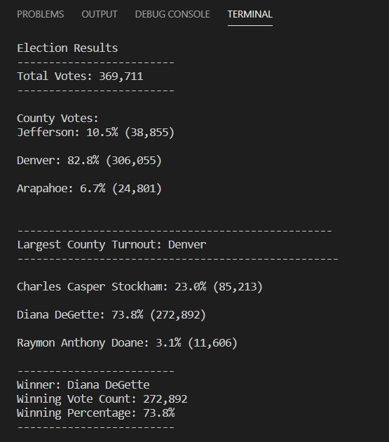

# PyPoll with Python

## Overview of Election Audit

### Purpose

- The purpose of this project is to calculate the results of the election using Python, including the total votes, votes and the percentages of votes of each county, the largest county turnout, as well as each candidate's vote count and percentage. 

## Election-Audit Results

- In this congressional elextion, 369,711 votes were casted.
- Denver makes up the largest voter population, with 306,055 votes casted. 82.8% of the total votes come from Denver. Jefferson county has the second largest vote count, with 38,855 votes (10.5%). Araphoe county has the least vote count, with only 24,801 votes making up 6.7% of the total votes. 
- As suggested above, Denver county has the largest number of votes. 
- Diana DeGette wins the election with 73.8% of the total votes. 11,606 people voted for her. Charles Casper Stockham comes in second place, with a vote count of 85,213 and a vote percentage of 23.0%. Raymon Anthony Doane has the fewest votes, with a vote count of 11,606 and a percentage of only 3.1%. 
- Diana DeGette wins the election with 11,606 votes, making up 73.8% of the total votes. 

[election_results.txt](analysis/election_results.txt)

## Election-Audit Summary

[PyPoll_Challenge.py](PyPoll_Challenge.py)
- This script calculates the results of the election by each county as well as by each candidate. This script can be used for any election with some modifications. 
    - For example, the election commission may want to look into the election results by parties. There could be a set of data that tells the commission how many self-identified Democrats, Republicans, as well as Independents voted for a certain candidate, and the script will calculate the results for the commission the same way it calculates the votes for each county.
    - The commission might also want to figure out the age groups of voters and how they contribute to the final result. In that case, instead of county names, county votes, and county percentages, the script will be altered so that age groups, votes of each age group, and percentages of votes of each group will be caulculated. 
